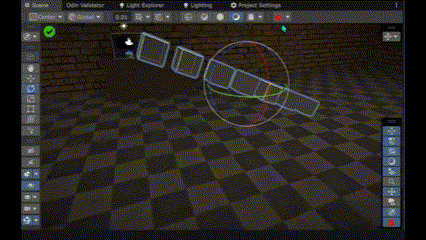

# Physics Dropper Overlay for Unity

## Overview

The **Physics Dropper Overlay** is a tool for Unity developers that allows efficient, physics-based placement of GameObjects in Unity's SceneView. By using simulated physics, this tool streamlines the positioning process, enabling natural placements without manual adjustments.

Using the Physics Dropper Overlay adds realism to your scene by leveraging Unity's physics engine. It is especially useful for creating dynamic environments, setting up test cases, or managing multiple objects, speeding up development while maintaining precision.

## Key Features

- **SceneView Integration**: Provides a seamless overlay within Unity's SceneView, allowing quick access to the dropper tool.
- **Toolbar Access**: Access the dropper via a dedicated toolbar button.
- **Configurable Stopping Criteria**: Choose when the simulation should stop based on time elapsed or velocity threshold.
- **Automatic Component Management**: Automatically adds necessary physics components like Colliders and Rigidbodies if absent.
- **MeshCollider Convex Settings Support**: Adjusts MeshColliders to be compatible with dynamic physics simulations.
- **Max Simulation Time Setting**: Allows users to define a maximum simulation duration to avoid endless simulations.

## How It Works

The **Physics Dropper Overlay** simplifies arranging GameObjects in Unity by using simulated physics within the editor. It ensures that each selected GameObject is equipped with necessary physics components and manages the simulation process in real time.

Workflow steps:

1. **Select GameObjects**: Highlight the GameObjects in the SceneView that you want to drop.
2. **Activate Dropper**: Click the custom toolbar button to initiate the dropper. This starts the physics simulation.
3. **Simulation Criteria**: The drop continues until one of the stopping criteria is satisfied:
   - **Time After Impact**: The simulation persists for a set time after the first contact.
   - **Velocity Threshold**: The simulation stops when the velocity falls below a predefined threshold.
4. **Automatic Cleanup**: The tool reverts any temporary components to return the GameObjects to their original state once the simulation is complete.

## Installation

To install the Physics Dropper Overlay:

1. Clone or download this repository.
2. Add the `PhysicsDropperOverlay.cs` script to your Unity project's `Editor` directory.
3. Launch Unity, and the Physics Dropper Overlay will be available within the SceneView.

## Usage

To use the Physics Dropper Overlay:

1. **Select GameObjects**: In the SceneView, select the GameObjects to drop.
2. **Click the Toolbar Button**: Locate and click the `PhysicsDropToolbarButton` to open the dropper interface.
3. **Configure Drop Settings**:
   - **Stopping Criteria**: Set criteria for ending the simulation:
     - **Time After Impact**: Duration after landing.
     - **Velocity Threshold**: Velocity below which the simulation stops.
   - **Maximum Simulation Time**: Set a time limit for the simulation.
4. **Start Simulation**: Click to initiate the drop. The objects will fall and interact naturally based on physics.

### Example Scenario

For designing a forest environment, instead of manually adjusting rocks and branches on uneven terrain, use the Physics Dropper tool to simulate realistic drops.

##  Toolbar Button and Interface

- **PhysicsDropToolbarButton**: The primary way to interact with the Physics Dropper. The button in Unity's SceneView toolbar allows you to start, configure, and stop the physics simulation.
- **PhysicsDropperWindow**: A popup window for modifying parameters like stopping criteria and maximum simulation time.

## Contributing

Contributions to improve the Physics Dropper Overlay are welcome. If you have feature suggestions or optimizations, feel free to fork the repository, make changes, and submit a pull request.

### Local Development

1. Fork this repository.
2. Create a new branch (`git checkout -b feature/NewFeature`).
3. Commit your changes (`git commit -m 'Add new feature'`).
4. Push to the branch (`git push origin feature/NewFeature`).
5. Open a Pull Request for review.

## Support

If you encounter issues or have questions, join our Discord community using the link at the top of this README.

## License

This project is licensed under the MIT License, allowing free use, modification, and distribution.

---

For more information, refer to the comments within the codebase or create an issue in the GitHub repository. Happy coding!
